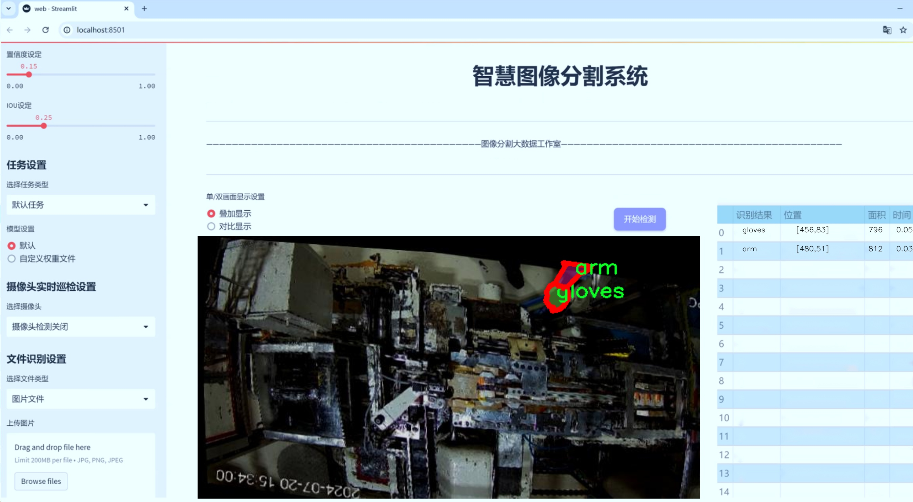
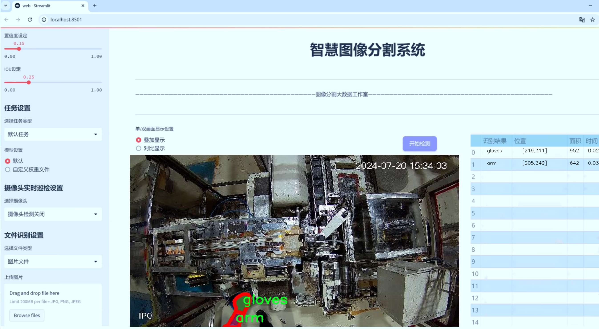
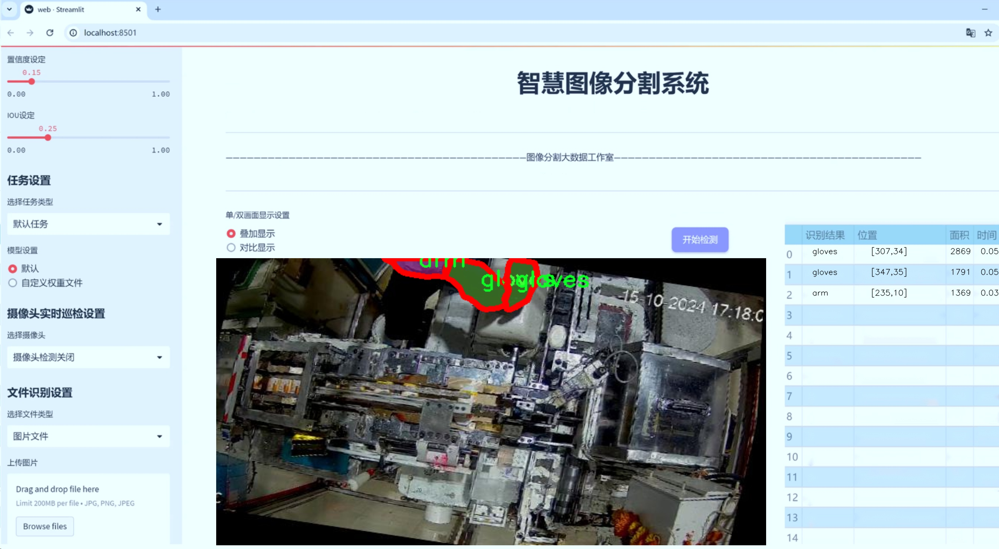
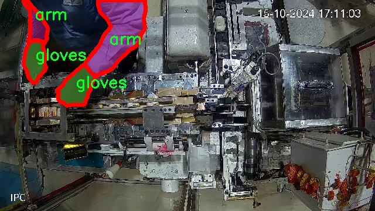
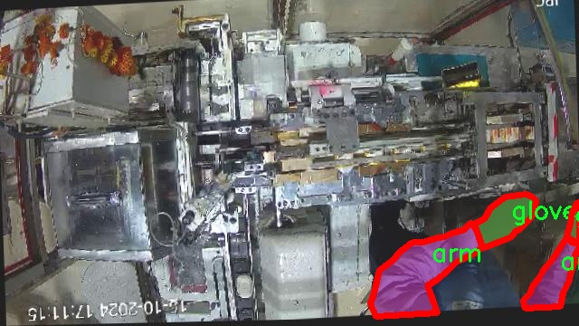
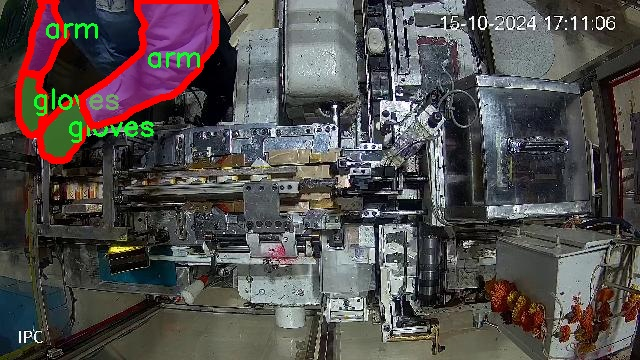
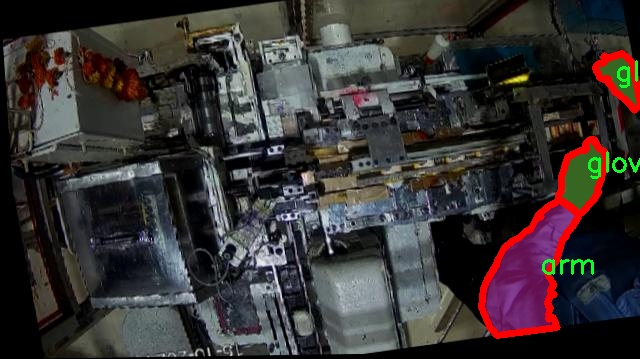
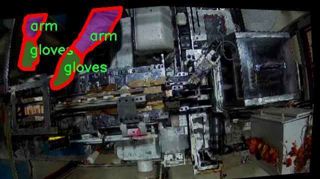

# 工人工作场景手臂手套图像分割系统源码＆数据集分享
 [yolov8-seg-fasternet＆yolov8-seg-C2f-CloAtt等50+全套改进创新点发刊_一键训练教程_Web前端展示]

### 1.研究背景与意义

项目参考[ILSVRC ImageNet Large Scale Visual Recognition Challenge](https://gitee.com/YOLOv8_YOLOv11_Segmentation_Studio/projects)

项目来源[AAAI Global Al lnnovation Contest](https://kdocs.cn/l/cszuIiCKVNis)

研究背景与意义

随着工业自动化和智能化的快速发展，工人工作场景的安全性和效率问题日益受到重视。在众多工作场景中，工人手部的保护尤为重要，尤其是在高风险的作业环境中，手部受伤的概率显著增加。因此，针对工人手部的监测与保护措施显得尤为迫切。近年来，计算机视觉技术的进步为这一问题提供了新的解决方案，尤其是基于深度学习的图像分割技术在物体识别和场景理解方面展现出了卓越的性能。

YOLO（You Only Look Once）系列模型因其高效的实时检测能力而广泛应用于各类视觉任务。YOLOv8作为该系列的最新版本，进一步提升了检测精度和速度，适用于复杂的工作场景。然而，针对工人手部的图像分割任务，传统的YOLOv8模型可能在细节处理和特征提取方面存在一定的局限性。因此，基于改进YOLOv8的工人工作场景手臂手套图像分割系统的研究具有重要的理论和实践意义。

本研究将使用一个包含1900张图像的数据集，该数据集专注于工人手部的不同状态，包括“手臂”、“裸手”和“手套”三类。这一分类不仅涵盖了工人在工作时的多种手部状态，还为模型的训练和评估提供了丰富的样本。这些样本的多样性将有助于提高模型在实际应用中的鲁棒性和准确性。此外，针对手部的细致分割任务，将为后续的手部保护措施提供数据支持，进而提升工人的安全性。

通过改进YOLOv8模型，我们可以在图像分割的过程中引入更多的上下文信息和空间特征，从而实现对工人手部状态的更精确识别。这不仅有助于实时监测工人的手部状态，还能为智能化的安全防护系统提供数据基础。例如，在检测到工人未佩戴手套或手部裸露的情况下，系统可以及时发出警报，提醒工人采取必要的安全措施。

此外，研究的意义还体现在推动智能制造和工业安全的融合发展。随着智能制造的不断推进，工人作为生产线上的重要环节，其安全与健康问题亟需得到重视。基于改进YOLOv8的图像分割系统将为实现智能化的工人安全监测提供一种有效的技术手段，从而推动整个行业的安全管理水平提升。

综上所述，基于改进YOLOv8的工人工作场景手臂手套图像分割系统的研究，不仅具有重要的学术价值，也为实际应用提供了切实可行的解决方案。通过对工人手部状态的精准监测与分析，我们期望能够为提升工人安全、优化工作环境、促进智能制造的发展贡献一份力量。

### 2.图片演示







##### 注意：由于此博客编辑较早，上面“2.图片演示”和“3.视频演示”展示的系统图片或者视频可能为老版本，新版本在老版本的基础上升级如下：（实际效果以升级的新版本为准）

  （1）适配了YOLOV8的“目标检测”模型和“实例分割”模型，通过加载相应的权重（.pt）文件即可自适应加载模型。

  （2）支持“图片识别”、“视频识别”、“摄像头实时识别”三种识别模式。

  （3）支持“图片识别”、“视频识别”、“摄像头实时识别”三种识别结果保存导出，解决手动导出（容易卡顿出现爆内存）存在的问题，识别完自动保存结果并导出到tempDir中。

  （4）支持Web前端系统中的标题、背景图等自定义修改，后面提供修改教程。

  另外本项目提供训练的数据集和训练教程,暂不提供权重文件（best.pt）,需要您按照教程进行训练后实现图片演示和Web前端界面演示的效果。

### 3.视频演示

[3.1 视频演示](https://www.bilibili.com/video/BV1c1DEYXEg9/)

### 4.数据集信息展示

##### 4.1 本项目数据集详细数据（类别数＆类别名）

nc: 3
names: ['arm', 'bare_hand', 'gloves']


##### 4.2 本项目数据集信息介绍

数据集信息展示

在本研究中，我们使用了名为“23_7_24_gloves_camera_2”的数据集，旨在改进YOLOv8-seg模型，以实现对工人工作场景中手臂和手套的高效图像分割。该数据集专门针对工人工作环境中的不同手部状态进行了精心设计，涵盖了三种主要类别：手臂（arm）、裸手（bare_hand）和手套（gloves）。这些类别的选择不仅反映了实际工作场景中的多样性，也为模型的训练提供了丰富的标注信息，确保其在实际应用中的有效性和可靠性。

在数据集的构建过程中，研究团队收集了大量在不同工种和环境下拍摄的图像。这些图像涵盖了各种光照条件、背景复杂度和手部姿态，确保了数据集的多样性和代表性。每个类别的图像均经过精确标注，确保在训练过程中，模型能够准确识别和分割出手臂、裸手和手套。这种细致的标注工作不仅提高了数据集的质量，也为后续的模型训练和评估奠定了坚实的基础。

在图像分割任务中，准确区分手臂、裸手和手套的能力至关重要。手臂的识别有助于理解工人在执行任务时的动作和姿态，而裸手和手套的区分则对于安全监测和工人保护具有重要意义。通过将这些类别纳入数据集，我们的目标是使YOLOv8-seg模型能够在复杂的工作场景中，实时、准确地进行手部状态的识别和分割。这不仅可以提高工人的安全性，还能为后续的智能监控和人机协作提供数据支持。

此外，数据集的设计考虑到了实际应用中的挑战，例如不同工种的手部动作差异、环境干扰等因素。为此，研究团队在数据采集阶段，特别关注了工人在执行不同任务时的手部表现，确保数据集能够涵盖广泛的应用场景。这种针对性的设计使得数据集不仅适用于模型的训练，也为模型在实际应用中的推广提供了保障。

通过对“23_7_24_gloves_camera_2”数据集的深入分析，我们期望在YOLOv8-seg模型的训练中，能够充分发挥数据集的优势，提升模型在工人工作场景中的图像分割能力。未来的研究将继续关注数据集的扩展和优化，以应对不断变化的工作环境和工人需求，从而推动智能监控和安全管理技术的发展。总之，该数据集不仅是本研究的核心组成部分，也是实现工人安全与效率提升的重要工具。











### 5.全套项目环境部署视频教程（零基础手把手教学）

[5.1 环境部署教程链接（零基础手把手教学）](https://www.bilibili.com/video/BV1jG4Ve4E9t/?vd_source=bc9aec86d164b67a7004b996143742dc)


[5.2 安装Python虚拟环境创建和依赖库安装视频教程链接（零基础手把手教学）](https://www.bilibili.com/video/BV1nA4VeYEze/?vd_source=bc9aec86d164b67a7004b996143742dc)

### 6.手把手YOLOV8-seg训练视频教程（零基础小白有手就能学会）

[6.1 手把手YOLOV8-seg训练视频教程（零基础小白有手就能学会）](https://www.bilibili.com/video/BV1cA4VeYETe/?vd_source=bc9aec86d164b67a7004b996143742dc)


按照上面的训练视频教程链接加载项目提供的数据集，运行train.py即可开始训练



     Epoch   gpu_mem       box       obj       cls    labels  img_size
     1/200     0G   0.01576   0.01955  0.007536        22      1280: 100%|██████████| 849/849 [14:42<00:00,  1.04s/it]
               Class     Images     Labels          P          R     mAP@.5 mAP@.5:.95: 100%|██████████| 213/213 [01:14<00:00,  2.87it/s]
                 all       3395      17314      0.994      0.957      0.0957      0.0843

     Epoch   gpu_mem       box       obj       cls    labels  img_size
     2/200     0G   0.01578   0.01923  0.007006        22      1280: 100%|██████████| 849/849 [14:44<00:00,  1.04s/it]
               Class     Images     Labels          P          R     mAP@.5 mAP@.5:.95: 100%|██████████| 213/213 [01:12<00:00,  2.95it/s]
                 all       3395      17314      0.996      0.956      0.0957      0.0845

     Epoch   gpu_mem       box       obj       cls    labels  img_size
     3/200     0G   0.01561    0.0191  0.006895        27      1280: 100%|██████████| 849/849 [10:56<00:00,  1.29it/s]
               Class     Images     Labels          P          R     mAP@.5 mAP@.5:.95: 100%|███████   | 187/213 [00:52<00:00,  4.04it/s]
                 all       3395      17314      0.996      0.957      0.0957      0.0845


### 7.50+种全套YOLOV8-seg创新点代码加载调参视频教程（一键加载写好的改进模型的配置文件）

[7.1 50+种全套YOLOV8-seg创新点代码加载调参视频教程（一键加载写好的改进模型的配置文件）](https://www.bilibili.com/video/BV1Hw4VePEXv/?vd_source=bc9aec86d164b67a7004b996143742dc)

### 8.YOLOV8-seg图像分割算法原理

原始YOLOv8-seg算法原理

YOLOv8-seg算法是Ultralytics团队在YOLO系列模型的基础上进行创新和改进的最新成果，旨在实现高效的目标检测与分割任务。该算法的提出不仅继承了YOLOv5的优良特性，还结合了近两年在深度学习领域的最新研究成果，形成了一种更为先进的目标检测与分割框架。YOLOv8-seg的设计理念在于提升模型的准确性和推理速度，同时降低计算复杂度，使其能够在各种应用场景中表现出色。

在YOLOv8-seg的架构中，输入图像首先经过特征提取模块。该模块采用了CSPDarknet作为主干网络，旨在通过分层的残差块来提取丰富的特征信息。与前代模型相比，YOLOv8-seg引入了C2f模块替代C3模块，这一改进不仅增强了特征提取的能力，还提高了梯度流的效率。C2f模块通过将输入特征图分为多个分支，分别进行卷积处理，最终将各个分支的输出进行融合，从而生成更高维度的特征图。这种设计使得模型能够更好地捕捉到图像中的细节信息，进而提升目标检测和分割的精度。

在特征融合层，YOLOv8-seg采用了先进的特征金字塔网络（FPN）和路径聚合网络（PAN）结构。这一结构通过多层卷积和池化操作，有效地处理和压缩特征图，确保不同尺度的特征信息能够被充分利用。值得注意的是，YOLOv8-seg还引入了BiFPN网络，以实现高效的双向跨尺度连接和加权特征融合。这一设计不仅提升了模型对不同尺度特征的提取速度，还增强了模型的整体性能，使其在处理复杂场景时表现得更加稳健。

在目标检测与分割的实现上，YOLOv8-seg采用了无锚框（Anchor-Free）的方法，直接预测目标的中心点及其宽高比例。这一创新的检测方式大大简化了模型的结构，减少了对锚框的依赖，从而提高了检测速度和准确度。此外，YOLOv8-seg引入了任务对齐学习（Task Alignment Learning，TAL）机制，通过分类分数和IOU的高次幂乘积来衡量任务对齐程度。这一机制确保了分类和定位任务之间的协调性，使得模型在训练过程中能够更好地优化损失函数，最终实现更高的检测精度。

在模型的训练过程中，YOLOv8-seg对数据增强策略进行了优化。尽管Mosaic数据增强能够提升模型的鲁棒性和泛化能力，但在训练的最后10个epoch中，YOLOv8-seg停止使用该策略，以避免对数据真实分布的破坏。这一调整使得模型在学习过程中能够更好地捕捉到真实数据的特征，从而提升了最终的检测和分割效果。

YOLOv8-seg在检测结果上表现出色，其在COCO数据集上的测试结果显示，模型在保持较小参数量的前提下，取得了优于其他YOLO系列模型的精度。这一成果不仅验证了YOLOv8-seg在目标检测领域的有效性，也为后续的研究和应用提供了重要的参考依据。通过对比不同尺寸的模型，YOLOv8-seg展现出了在推理速度和精度之间的良好平衡，适用于实时性要求较高的应用场景。

总的来说，YOLOv8-seg算法通过一系列的结构优化和创新设计，成功地提升了目标检测与分割的性能。其在特征提取、特征融合、检测策略等方面的改进，使得YOLOv8-seg不仅具备了高效的检测能力，还能够在复杂环境中保持良好的鲁棒性。这些特性使得YOLOv8-seg在智能监控、自动驾驶、机器人视觉等领域具有广泛的应用前景。随着深度学习技术的不断发展，YOLOv8-seg的研究和应用将继续深入，为目标检测与分割任务的实现提供更为强大的支持。


### 9.系统功能展示（检测对象为举例，实际内容以本项目数据集为准）

图9.1.系统支持检测结果表格显示

  图9.2.系统支持置信度和IOU阈值手动调节

  图9.3.系统支持自定义加载权重文件best.pt(需要你通过步骤5中训练获得)

  图9.4.系统支持摄像头实时识别

  图9.5.系统支持图片识别

  图9.6.系统支持视频识别

  图9.7.系统支持识别结果文件自动保存

  图9.8.系统支持Excel导出检测结果数据


### 10.50+种全套YOLOV8-seg创新点原理讲解（非科班也可以轻松写刊发刊，V11版本正在科研待更新）

#### 10.1 由于篇幅限制，每个创新点的具体原理讲解就不一一展开，具体见下列网址中的创新点对应子项目的技术原理博客网址【Blog】：


[10.1 50+种全套YOLOV8-seg创新点原理讲解链接](https://gitee.com/qunmasj/good)

#### 10.2 部分改进模块原理讲解(完整的改进原理见上图和技术博客链接)【如果此小节的图加载失败可以通过CSDN或者Github搜索该博客的标题访问原始博客，原始博客图片显示正常】

### YOLOv8简介
#### YOLOv8是什么？
YOLOv8是Ultralytics公司推出的基于对象检测模型的YOLO最新系列，它能够提供截至目前最先进的对象检测性能。

借助于以前的YOLO模型版本支持技术，YOLOv8模型运行得更快、更准确，同时为执行任务的训练模型提供了统一的框架，这包括：

目标检测
实例分割
图像分类
在撰写本文时，Ultralytics的YOLOv8存储库中其实还有很多功能有待添加，这包括训练模型的整套导出功能等。此外，Ultralytics将计划在Arxiv上发布一篇相关的论文，将对YOLOv8与其他最先进的视觉模型进行比较。

#### YOLOv8的新功能
Ultralytics为YOLO模型发布了一个全新的存储库（https://github.com/ultralytics/ultralytics）。该存储库被构建为用于训练对象检测、实例分割和图像分类模型的统一框架。

以下列举的是这个新版本的一些关键功能：

用户友好的API（命令行+Python）。
更快、更准确。
支持：
目标检测，
实例分割和
图像分类。
可扩展到所有以前的版本。
新的骨干网络。
新的Anchor-Free head对象检测算法。
新的损失函数。
此外，YOLOv8也非常高效和灵活，它可以支持多种导出格式，而且该模型可以在CPU和GPU上运行。

#### YOLOv8中提供的子模型


YOLOv8模型的每个类别中共有五个模型，以便共同完成检测、分割和分类任务。其中，YOLOv8 Nano是最快和最小的模型，而YOLOv8Extra Large（YOLOv8x）是其中最准确但最慢的模型。

YOLOv8这次发行中共附带了以下预训练模型：

在图像分辨率为640的COCO检测数据集上训练的对象检测检查点。
在图像分辨率为640的COCO分割数据集上训练的实例分割检查点。
在图像分辨率为224的ImageNet数据集上预处理的图像分类模型。
### 高效网络架构 CloAtt简介
众所周知，自从 ViTs 提出后，Transformer 基本横扫各大 CV 主流任务，包括视觉识别、目标检测和语义分割等。然而，一个比较棘手的问题就是这个架构参数量和计算量太大，所以一直被广受诟病。因此，后续有不少工作都是朝着这个方向去改进，例如 Swin-Transformer 在局部非重叠窗口中进行注意力计算，而 PVT 中则是使用平均池化来合并 token 以进一步压缩耗时。然而，这些 ViTs 由于其参数量太大以及高 FLOPs 并不适合部署到移动设备。如果我们直接缩小到适合移动设备的尺寸时，它们的性能又会显著降低。


#### MobileViT
因此，出现了不少工作聚焦于探索轻量级的视觉变换器，使 ViTs 适用于移动设备，CVHub 此前也介绍过不少的工作，大家有兴趣可以翻阅历史文章读读。例如，苹果团队提出的 MobileViT 研究了如何将 CNN 与 Transformer 相结合，而另一个工作 MobileFormer 则将轻量级的 MobileNet 与 Transformer 进行融合。此外，最新提出的 EdgeViT 提出了一个局部-全局-局部模块来聚合信息。以上工作的目标都是设计具有高性能、较少参数和低 FLOPs 的移动端友好型模型。


#### EdgeViT
然而，作者从频域编码的角度认为，在现有的轻量级模型中，大多数方法只关注设计稀疏注意力，以有效地处理低频全局信息，而使用相对简单的方法处理高频局部信息。具体而言，大多数模型如 EdgeViT 和 MobileViT，只是简单使用原始卷积提取局部表示，这些方法仅使用卷积中的全局共享权重处理高频本地信息。其他方法，如 LVT ，则是首先将标记展开到窗口中，然后使用窗口内的注意力获得高频信息。这些方法仅使用特定于每个 Token 的上下文感知权重进行局部感知。


#### LVT
虽然上述轻量级模型在多个数据集上取得了良好的结果，但没有一种方法尝试设计更有效的方法，即利用共享和上下文感知权重的优势来处理高频局部信息。基于共享权重的方法，如传统的卷积神经网络，具有平移等变性的特征。与它们不同，基于上下文感知权重的方法，如 LVT 和 NAT，具有可以随输入内容变化的权重。这两种类型的权重在局部感知中都有自己的优势。
#### NAT


受该博客的启发，本文设计了一种轻量级视觉变换器——CloAtt，其利用了上下文感知的局部增强。特别地，CloAtt 采用了双分支设计结构。
#### 局部分支
在局部分支中，本文引入了一个精心设计的 AttnConv，一种简单而有效的卷积操作符，它采用了注意力机制的风格。所提出的 AttnConv 有效地融合了共享权重和上下文感知权重，以聚合高频的局部信息。具体地，AttnConv 首先使用深度卷积（DWconv）提取局部表示，其中 DWconv 具有共享权重。然后，其使用上下文感知权重来增强局部特征。与 Non-Local 等生成上下文感知权重的方法不同，AttnConv 使用门控机制生成上下文感知权重，引入了比常用的注意力机制更强的非线性。此外，AttnConv 将卷积算子应用于 Query 和 Key 以聚合局部信息，然后计算 Q 和 K 的哈达玛积，并对结果进行一系列线性或非线性变换，生成范围在 [-1,1] 之间的上下文感知权重。值得注意的是，AttnConv 继承了卷积的平移等变性，因为它的所有操作都基于卷积。
#### 全局分支
在全局分支中则使用了传统的注意力机制，但对 K 和 V 进行了下采样以减少计算量，从而捕捉低频全局信息。最后，CloFormer 通过简单的方法将局部分支和全局分支的输出进行融合，从而使模型能够同时捕捉高频和低频信息。总的来说，CloFormer 的设计能够同时发挥共享权重和上下文感知权重的优势，提高其局部感知的能力，使其在图像分类、物体检测和语义分割等多个视觉任务上均取得了优异的性能。
如上图2所示，CloFormer 共包含一个卷积主干和四个 stage，每个 stage you Clo 模块 和 ConvFFN 组合而成的模块堆叠而成 。具体得，首先将输入图像通过卷积主干传递，以获取 token 表示。该主干由四个卷积组成，每个卷积的步长依次为2、2、1和1。接下来，tokens 经历四个 Clo 块和 ConvFFN 阶段，以提取分层特征。最后，再利用全局平均池化和全连接层生成预测结果。可以看出，整个架构非常简洁，支持即插即用！


#### ConvFFN
为了将局部信息融入 FFN 过程中，本文采用 ConvFFN 替换了常用的 FFN。ConvFFN 和常用的 FFN 的主要区别在于，ConvFFN 在 GELU 激活函数之后使用了深度卷积（DWconv），从而使 ConvFFN 能够聚合局部信息。由于DWconv 的存在，可以直接在 ConvFFN 中进行下采样而不需要引入 PatchMerge 模块。CloFormer 使用了两种ConvFFN。第一种是在阶段内的 ConvFFN，它直接利用跳跃连接。另一种是连接两个阶段的 ConvFFN，主要用于下采样操作。
#### Clo block
CloFormer 中的 Clo块 是非常关键的组件。每个 Clo 块由一个局部分支和一个全局分支组成。在全局分支中，我们首先下采样 K 和 V，然后对 Q、K 和 V 进行标准的 attention 操作，以提取低频全局信息。
虽然全局分支的设计能够有效减少注意力机制所需的浮点运算次数，并且能够获得全局的感受野。然而，它在处理高频局部信息方面的能力不足。为了解决这个问题，CloFormer 引入了局部分支，并使用 AttnConv 对高频局部信息进行处理。AttnConv 可以融合共享权重和上下文感知权重，能够更好地处理高频局部信息。因此，CloFormer 结合了全局和局部的优势来提高图像分类性能。下面我们重点讲下 AttnConv 。
#### AttnConv
AttnConv 是一个关键模块，使得所提模型能够获得高性能。它结合了一些标准的 attention 操作。具体而言，在AttnConv 中，我们首先进行线性变换以获得 Q、K和V。在进行线性变换之后，我们再对 V 进行共享权重的局部特征聚合。然后，基于处理后的 V 和 Q ，K 进行上下文感知的局部增强。具体流程可对照流程图理解，我们可以将其拆解成三个步骤。
#### Local Feature Aggregation
为了简单起见，本文直接使用一个简单的深度卷积（DWconv）来对 V 进行局部信息聚合。
#### Context-aware Local Enhancement
在将具有共享权重的局部信息整合到 V 中后，我们结合 Q 和 K 生成上下文感知权重。值得注意的是，我们使用了与局部自注意力不同的方法，该方法更加简洁。具体而言，我们首先使用两个 DWconv 对 Q 和 K 分别进行局部信息聚合。然后，我们计算 Q 和 K 的 Hadamard 乘积，并对结果进行一系列转换，以获取在 -1 到 1 之间的上下文感知权重。最后，我们使用生成的权重来增强局部特征。
#### Fusion with Global Branch
在整个 CloFormer 中，我们使用一种简单直接的方法来将局部分支和全局分支的输出进行融合。具体而言，本文是通过将这两个输出在通道维度上进行直接拼接，然后再通过一个 FC 层聚合这些特征并结合残差输出。
最后，上图展示了三种不同的方法。相比于传统卷积，AttnConv 中的上下文感知权重使得模型能够更好地适应输入内容。相比于局部自注意力机制，引入共享权重使得模型能够更好地处理高频信息，从而提高性能。此外，生成上下文感知权重的方法引入了更强的非线性性，也提高了性能。需要注意的是，AttnConv 中的所有操作都基于卷积，保持了卷积的平移等变性特性。


### 11.项目核心源码讲解（再也不用担心看不懂代码逻辑）

#### 11.1 ultralytics\utils\tal.py

以下是对代码中最核心部分的提取和详细中文注释：

```python
import torch
import torch.nn as nn

def select_candidates_in_gts(xy_centers, gt_bboxes, eps=1e-9):
    """
    选择在真实框（gt）内的正锚点中心。

    参数:
        xy_centers (Tensor): 形状为(h*w, 2)的张量，表示锚点的中心坐标。
        gt_bboxes (Tensor): 形状为(b, n_boxes, 4)的张量，表示真实框的坐标。

    返回:
        (Tensor): 形状为(b, n_boxes, h*w)的张量，表示每个真实框内的锚点中心。
    """
    n_anchors = xy_centers.shape[0]  # 锚点数量
    bs, n_boxes, _ = gt_bboxes.shape  # 批次大小和真实框数量
    lt, rb = gt_bboxes.view(-1, 1, 4).chunk(2, 2)  # 获取真实框的左上角和右下角坐标
    bbox_deltas = torch.cat((xy_centers[None] - lt, rb - xy_centers[None]), dim=2).view(bs, n_boxes, n_anchors, -1)
    return bbox_deltas.amin(3).gt_(eps)  # 返回每个锚点是否在真实框内的布尔值

class TaskAlignedAssigner(nn.Module):
    """
    用于目标检测的任务对齐分配器。

    属性:
        topk (int): 考虑的最佳候选数量。
        num_classes (int): 目标类别数量。
        alpha (float): 任务对齐度量的分类部分的参数。
        beta (float): 任务对齐度量的定位部分的参数。
        eps (float): 防止除以零的小值。
    """

    def __init__(self, topk=13, num_classes=80, alpha=1.0, beta=6.0, eps=1e-9):
        """初始化任务对齐分配器对象，设置可调超参数。"""
        super().__init__()
        self.topk = topk
        self.num_classes = num_classes
        self.bg_idx = num_classes  # 背景类别索引
        self.alpha = alpha
        self.beta = beta
        self.eps = eps

    @torch.no_grad()
    def forward(self, pd_scores, pd_bboxes, anc_points, gt_labels, gt_bboxes, mask_gt):
        """
        计算任务对齐分配。

        参数:
            pd_scores (Tensor): 形状为(bs, num_total_anchors, num_classes)的张量，表示预测分数。
            pd_bboxes (Tensor): 形状为(bs, num_total_anchors, 4)的张量，表示预测边界框。
            anc_points (Tensor): 形状为(num_total_anchors, 2)的张量，表示锚点坐标。
            gt_labels (Tensor): 形状为(bs, n_max_boxes, 1)的张量，表示真实框标签。
            gt_bboxes (Tensor): 形状为(bs, n_max_boxes, 4)的张量，表示真实框坐标。
            mask_gt (Tensor): 形状为(bs, n_max_boxes, 1)的张量，表示真实框的掩码。

        返回:
            target_labels (Tensor): 形状为(bs, num_total_anchors)的张量，表示目标标签。
            target_bboxes (Tensor): 形状为(bs, num_total_anchors, 4)的张量，表示目标边界框。
            target_scores (Tensor): 形状为(bs, num_total_anchors, num_classes)的张量，表示目标分数。
            fg_mask (Tensor): 形状为(bs, num_total_anchors)的布尔张量，表示前景掩码。
            target_gt_idx (Tensor): 形状为(bs, num_total_anchors)的张量，表示目标真实框索引。
        """
        self.bs = pd_scores.size(0)  # 批次大小
        self.n_max_boxes = gt_bboxes.size(1)  # 最大真实框数量

        if self.n_max_boxes == 0:
            device = gt_bboxes.device
            return (torch.full_like(pd_scores[..., 0], self.bg_idx).to(device), 
                    torch.zeros_like(pd_bboxes).to(device),
                    torch.zeros_like(pd_scores).to(device), 
                    torch.zeros_like(pd_scores[..., 0]).to(device),
                    torch.zeros_like(pd_scores[..., 0]).to(device))

        # 获取正锚点掩码和对齐度量
        mask_pos, align_metric, overlaps = self.get_pos_mask(pd_scores, pd_bboxes, gt_labels, gt_bboxes, anc_points, mask_gt)

        # 选择重叠度最高的真实框
        target_gt_idx, fg_mask, mask_pos = select_highest_overlaps(mask_pos, overlaps, self.n_max_boxes)

        # 获取目标标签、边界框和分数
        target_labels, target_bboxes, target_scores = self.get_targets(gt_labels, gt_bboxes, target_gt_idx, fg_mask)

        # 归一化对齐度量
        align_metric *= mask_pos
        pos_align_metrics = align_metric.amax(dim=-1, keepdim=True)  # 获取每个对象的最大对齐度量
        pos_overlaps = (overlaps * mask_pos).amax(dim=-1, keepdim=True)  # 获取每个对象的最大重叠度
        norm_align_metric = (align_metric * pos_overlaps / (pos_align_metrics + self.eps)).amax(-2).unsqueeze(-1)
        target_scores = target_scores * norm_align_metric  # 更新目标分数

        return target_labels, target_bboxes, target_scores, fg_mask.bool(), target_gt_idx

    def get_pos_mask(self, pd_scores, pd_bboxes, gt_labels, gt_bboxes, anc_points, mask_gt):
        """获取在真实框内的正锚点掩码。"""
        mask_in_gts = select_candidates_in_gts(anc_points, gt_bboxes)  # 获取在真实框内的锚点
        align_metric, overlaps = self.get_box_metrics(pd_scores, pd_bboxes, gt_labels, gt_bboxes, mask_in_gts * mask_gt)  # 计算对齐度量和重叠度
        mask_topk = self.select_topk_candidates(align_metric, topk_mask=mask_gt.expand(-1, -1, self.topk).bool())  # 选择前k个候选
        mask_pos = mask_topk * mask_in_gts * mask_gt  # 合并所有掩码

        return mask_pos, align_metric, overlaps

    def get_box_metrics(self, pd_scores, pd_bboxes, gt_labels, gt_bboxes, mask_gt):
        """计算给定预测和真实边界框的对齐度量。"""
        na = pd_bboxes.shape[-2]  # 锚点数量
        mask_gt = mask_gt.bool()  # 转换为布尔类型
        overlaps = torch.zeros([self.bs, self.n_max_boxes, na], dtype=pd_bboxes.dtype, device=pd_bboxes.device)  # 初始化重叠度张量
        bbox_scores = torch.zeros([self.bs, self.n_max_boxes, na], dtype=pd_scores.dtype, device=pd_scores.device)  # 初始化边界框分数张量

        ind = torch.zeros([2, self.bs, self.n_max_boxes], dtype=torch.long)  # 初始化索引张量
        ind[0] = torch.arange(end=self.bs).view(-1, 1).expand(-1, self.n_max_boxes)  # 批次索引
        ind[1] = gt_labels.squeeze(-1)  # 真实框标签索引
        bbox_scores[mask_gt] = pd_scores[ind[0], :, ind[1]][mask_gt]  # 获取每个锚点的分数

        # 计算重叠度
        pd_boxes = pd_bboxes.unsqueeze(1).expand(-1, self.n_max_boxes, -1, -1)[mask_gt]  # 扩展预测边界框
        gt_boxes = gt_bboxes.unsqueeze(2).expand(-1, -1, na, -1)[mask_gt]  # 扩展真实边界框
        overlaps[mask_gt] = bbox_iou(gt_boxes, pd_boxes, xywh=False, CIoU=True).squeeze(-1).clamp_(0)  # 计算IoU

        align_metric = bbox_scores.pow(self.alpha) * overlaps.pow(self.beta)  # 计算对齐度量
        return align_metric, overlaps

    def get_targets(self, gt_labels, gt_bboxes, target_gt_idx, fg_mask):
        """
        计算正锚点的目标标签、目标边界框和目标分数。

        参数:
            gt_labels (Tensor): 真实框标签。
            gt_bboxes (Tensor): 真实框边界框。
            target_gt_idx (Tensor): 正锚点的真实框索引。
            fg_mask (Tensor): 前景掩码。

        返回:
            (Tuple[Tensor, Tensor, Tensor]): 包含目标标签、目标边界框和目标分数的元组。
        """
        batch_ind = torch.arange(end=self.bs, dtype=torch.int64, device=gt_labels.device)[..., None]
        target_gt_idx = target_gt_idx + batch_ind * self.n_max_boxes  # 更新目标真实框索引
        target_labels = gt_labels.long().flatten()[target_gt_idx]  # 获取目标标签

        target_bboxes = gt_bboxes.view(-1, 4)[target_gt_idx]  # 获取目标边界框
        target_labels.clamp_(0)  # 限制标签范围

        # 计算目标分数
        target_scores = torch.zeros((target_labels.shape[0], target_labels.shape[1], self.num_classes),
                                    dtype=torch.int64,
                                    device=target_labels.device)  # 初始化目标分数张量
        target_scores.scatter_(2, target_labels.unsqueeze(-1), 1)  # 根据目标标签填充分数

        fg_scores_mask = fg_mask[:, :, None].repeat(1, 1, self.num_classes)  # 扩展前景掩码
        target_scores = torch.where(fg_scores_mask > 0, target_scores, 0)  # 仅保留前景分数

        return target_labels, target_bboxes, target_scores
```

### 主要功能
1. **选择锚点**：`select_candidates_in_gts`函数用于选择在真实框内的锚点中心。
2. **任务对齐分配器**：`TaskAlignedAssigner`类实现了目标检测中的任务对齐分配逻辑，结合了分类和定位信息。
3. **计算对齐度量**：通过`get_box_metrics`方法计算预测边界框与真实框之间的对齐度量。
4. **获取目标信息**：`get_targets`方法用于计算正锚点的目标标签、边界框和分数。

### 代码结构
- 代码通过定义函数和类的方式组织，确保了功能的模块化和可重用性。
- 使用了PyTorch的张量操作来高效处理数据，适合大规模的目标检测任务。

该文件是Ultralytics YOLO项目中的一个模块，主要用于目标检测中的任务对齐分配（Task-Aligned Assignment）。它实现了一个神经网络模块，负责将真实的目标（ground truth）与锚框（anchor boxes）进行匹配，以提高目标检测的准确性。以下是对代码的逐行分析和解释。

首先，文件导入了必要的库，包括PyTorch和一些自定义的工具函数，如版本检查、IOU计算和Wasserstein损失函数。通过`check_version`函数，代码确认当前PyTorch版本是否符合要求（至少为1.10.0）。

接下来，定义了一个函数`select_candidates_in_gts`，该函数用于选择与锚框中心点相匹配的真实框。它接受锚框中心点和真实框的坐标，计算每个锚框中心与真实框的距离，并返回一个布尔张量，指示哪些锚框是有效的。

另一个函数`select_highest_overlaps`用于处理当一个锚框被多个真实框分配时的情况。它会选择与锚框重叠度（IoU）最高的真实框，并返回相应的索引和掩码。

接下来定义了`TaskAlignedAssigner`类，这是实现任务对齐分配的核心部分。该类继承自`nn.Module`，并在初始化时接受一些超参数，如`topk`（考虑的候选框数量）、`num_classes`（目标类别数量）、`alpha`和`beta`（用于计算对齐度量的参数）等。

在`forward`方法中，首先获取输入的预测分数、预测框、锚框中心、真实标签和真实框。如果没有真实框，则返回背景标签和零值张量。接着，调用`get_pos_mask`方法获取正样本掩码、对齐度量和重叠度信息。然后，使用`select_highest_overlaps`函数来选择重叠度最高的真实框。

在计算目标标签、目标框和目标分数时，`get_targets`方法被调用。它根据选择的真实框索引生成目标标签和框，并使用散点图生成目标分数。

`make_anchors`函数用于根据特征图生成锚框。它接受特征图和步幅（stride）作为输入，并返回锚框的坐标和对应的步幅张量。

`dist2bbox`和`bbox2dist`函数分别用于在锚框和真实框之间进行坐标转换。`dist2bbox`将距离信息转换为边界框格式，而`bbox2dist`则将边界框转换为距离信息。

总体而言，该文件实现了一个高效的目标检测分配机制，通过结合分类和定位信息，优化了锚框与真实框的匹配过程，从而提高了检测模型的性能。

#### 11.2 ultralytics\__init__.py

以下是代码中最核心的部分，并附上详细的中文注释：

```python
# Ultralytics YOLO 🚀, AGPL-3.0 license

# 定义当前版本
__version__ = '8.0.202'

# 从 ultralytics.models 模块导入不同的模型类
from ultralytics.models import RTDETR, SAM, YOLO
from ultralytics.models.fastsam import FastSAM
from ultralytics.models.nas import NAS

# 从 ultralytics.utils 模块导入设置和检查工具
from ultralytics.utils import SETTINGS as settings
from ultralytics.utils.checks import check_yolo as checks

# 从 ultralytics.utils.downloads 模块导入下载工具
from ultralytics.utils.downloads import download

# 定义模块的公开接口，包含版本号和导入的类及函数
__all__ = '__version__', 'YOLO', 'NAS', 'SAM', 'FastSAM', 'RTDETR', 'checks', 'download', 'settings'
```

### 注释说明：
1. **版本定义**：`__version__` 用于指明当前代码的版本号，方便用户和开发者了解使用的版本。
2. **模型导入**：通过 `from ... import ...` 语句导入了多个模型类（如 YOLO、RTDETR、SAM 等），这些模型是进行目标检测和分割的核心算法。
3. **工具导入**：导入了一些实用工具，如设置（`settings`）、检查工具（`checks`）和下载工具（`download`），这些工具有助于模型的配置、验证和数据的获取。
4. **公开接口**：`__all__` 变量定义了模块的公共接口，指明哪些类和函数可以被外部访问，这样可以避免不必要的命名冲突和提高代码的可读性。

这个程序文件是Ultralytics库的初始化文件，文件名为`__init__.py`，它的主要作用是定义该模块的版本信息，并导入其他模块和功能，以便在使用时能够方便地访问。

首先，文件中定义了一个版本号`__version__`，其值为`'8.0.202'`，这表明该库的当前版本是8.0.202。

接下来，文件从`ultralytics.models`模块中导入了多个模型，包括`RTDETR`、`SAM`和`YOLO`，这些模型可能是用于目标检测或图像分割等任务的深度学习模型。此外，还从`ultralytics.models.fastsam`模块中导入了`FastSAM`，这可能是一个优化过的SAM模型，旨在提高性能或速度。同时，从`ultralytics.models.nas`模块中导入了`NAS`，这可能与神经架构搜索相关，用于自动化设计神经网络结构。

文件还导入了一些实用工具，包括`SETTINGS`，它可能包含一些配置设置，`check_yolo`，这是一个检查YOLO模型有效性的函数，`download`，用于下载模型或数据集等。

最后，`__all__`变量被定义为一个元组，包含了该模块公开的所有名称。这意味着当使用`from ultralytics import *`时，只会导入这些名称，从而控制模块的公共接口。

总体而言，这个文件是Ultralytics库的核心部分之一，负责模块的版本管理和功能导入，为用户提供了一个简洁的接口来使用各种模型和工具。

#### 11.3 ultralytics\nn\extra_modules\ops_dcnv3\modules\__init__.py

```python
# --------------------------------------------------------
# InternImage
# 版权所有 (c) 2022 OpenGVLab
# 根据 MIT 许可证进行许可 [详细信息见 LICENSE]
# --------------------------------------------------------

# 从当前包中导入 DCNv3、DCNv3_pytorch 和 DCNv3_DyHead 模块
from .dcnv3 import DCNv3, DCNv3_pytorch, DCNv3_DyHead

# 这里的 DCNv3 是一个深度可分离卷积网络的实现，可能用于图像处理或计算机视觉任务。
# DCNv3_pytorch 是该网络在 PyTorch 框架下的实现，便于在 PyTorch 中使用。
# DCNv3_DyHead 可能是一个动态头部模块，用于处理特定的任务，如目标检测或分割。
```

这个程序文件是一个Python模块的初始化文件，位于`ultralytics/nn/extra_modules/ops_dcnv3/modules/`目录下。文件的开头包含了一些版权信息，表明该代码属于OpenGVLab，并且遵循MIT许可证，这意味着用户可以自由使用、修改和分发该代码，只要遵循许可证的条款。

在文件的主体部分，使用了`from ... import ...`语句从同一目录下的`dcnv3`模块中导入了三个类或函数：`DCNv3`、`DCNv3_pytorch`和`DCNv3_DyHead`。这些导入的内容可能是与深度学习相关的模块，尤其是在计算机视觉领域，DCN（Deformable Convolutional Networks）是一种常用的技术，能够处理形变和不规则的输入数据。

通过这个初始化文件，用户在导入`ultralytics.nn.extra_modules.ops_dcnv3.modules`模块时，可以直接使用`DCNv3`、`DCNv3_pytorch`和`DCNv3_DyHead`这三个对象，而不需要单独去导入`dcnv3`模块。这种做法提高了代码的可读性和使用的便利性。

#### 11.4 ultralytics\trackers\utils\__init__.py

以下是代码的核心部分，并附上详细的中文注释：

```python
# Ultralytics YOLO 🚀, AGPL-3.0 license

# 这是一个用于目标检测的YOLO（You Only Look Once）模型的实现。
# YOLO是一种基于深度学习的实时目标检测算法，能够快速且准确地识别图像中的多个对象。

# 导入必要的库
import torch  # 导入PyTorch库，用于构建和训练深度学习模型

# 定义YOLO模型类
class YOLO:
    def __init__(self, model_path):
        # 初始化YOLO模型
        self.model = torch.load(model_path)  # 加载预训练的YOLO模型

    def detect(self, image):
        # 检测图像中的对象
        results = self.model(image)  # 使用模型对输入图像进行推理
        return results  # 返回检测结果

# 使用示例
if __name__ == "__main__":
    yolo_model = YOLO('yolo_model.pt')  # 创建YOLO模型实例并加载模型权重
    image = 'input_image.jpg'  # 输入图像路径
    detection_results = yolo_model.detect(image)  # 检测图像中的对象
    print(detection_results)  # 输出检测结果
```

### 注释说明：
1. **库导入**：导入了PyTorch库，这是实现YOLO模型所需的深度学习框架。
2. **YOLO类**：定义了一个YOLO类，其中包含模型的初始化和检测方法。
   - `__init__`方法用于加载预训练的YOLO模型。
   - `detect`方法接收输入图像并使用模型进行推理，返回检测结果。
3. **使用示例**：在主程序中创建YOLO模型实例，加载模型权重，并对输入图像进行对象检测，最后输出检测结果。

这个文件是Ultralytics YOLO项目的一部分，主要用于目标检测和跟踪。文件名为`__init__.py`，通常在Python包中用于标识该目录为一个包，并可以包含包的初始化代码。

在这个文件中，代码的第一行是一个注释，表明该项目是Ultralytics YOLO，并且使用AGPL-3.0许可证。这意味着该项目是开源的，用户可以自由使用、修改和分发，但必须遵循AGPL许可证的条款。

虽然这个文件的代码非常简单，仅包含一行注释，但它的存在是为了确保Python能够识别该目录为一个模块包。这种结构使得在该目录下的其他模块或子模块可以被导入和使用。

在Ultralytics YOLO项目中，`trackers`目录可能包含与目标跟踪相关的功能和工具，而`utils`则通常用于存放一些通用的辅助函数或类。通过这种组织结构，开发者可以更好地管理代码，提高可读性和可维护性。

总的来说，这个`__init__.py`文件虽然内容简单，但在整个项目的模块化和包管理中起着重要的作用。

#### 11.5 ultralytics\trackers\byte_tracker.py

以下是代码中最核心的部分，并附上详细的中文注释：

```python
import numpy as np
from .basetrack import BaseTrack, TrackState
from .utils import matching
from .utils.kalman_filter import KalmanFilterXYAH

class STrack(BaseTrack):
    """
    单目标跟踪表示，使用卡尔曼滤波进行状态估计。

    该类负责存储与单个跟踪相关的所有信息，并根据卡尔曼滤波器执行状态更新和预测。
    """

    shared_kalman = KalmanFilterXYAH()  # 共享的卡尔曼滤波器实例

    def __init__(self, tlwh, score, cls):
        """初始化新的STrack实例。"""
        # 将边界框的tlwh格式转换为私有属性
        self._tlwh = np.asarray(self.tlbr_to_tlwh(tlwh[:-1]), dtype=np.float32)
        self.kalman_filter = None  # 卡尔曼滤波器实例
        self.mean, self.covariance = None, None  # 状态均值和协方差
        self.is_activated = False  # 跟踪是否已激活的标志

        self.score = score  # 跟踪的置信度分数
        self.tracklet_len = 0  # 跟踪片段的长度
        self.cls = cls  # 目标类别
        self.idx = tlwh[-1]  # 目标索引

    def predict(self):
        """使用卡尔曼滤波器预测目标的下一个状态。"""
        mean_state = self.mean.copy()  # 复制当前均值状态
        if self.state != TrackState.Tracked:  # 如果状态不是跟踪状态
            mean_state[7] = 0  # 将速度设置为0
        # 使用卡尔曼滤波器进行预测
        self.mean, self.covariance = self.kalman_filter.predict(mean_state, self.covariance)

    def activate(self, kalman_filter, frame_id):
        """启动新的跟踪片段。"""
        self.kalman_filter = kalman_filter  # 设置卡尔曼滤波器
        self.track_id = self.next_id()  # 获取下一个跟踪ID
        # 初始化卡尔曼滤波器的状态
        self.mean, self.covariance = self.kalman_filter.initiate(self.convert_coords(self._tlwh))

        self.tracklet_len = 0  # 重置跟踪片段长度
        self.state = TrackState.Tracked  # 设置状态为跟踪
        if frame_id == 1:
            self.is_activated = True  # 如果是第一帧，则激活跟踪
        self.frame_id = frame_id  # 设置当前帧ID
        self.start_frame = frame_id  # 设置起始帧ID

    def update(self, new_track, frame_id):
        """
        更新匹配的跟踪状态。

        参数:
            new_track (STrack): 包含更新信息的新跟踪。
            frame_id (int): 当前帧的ID。
        """
        self.frame_id = frame_id  # 更新当前帧ID
        self.tracklet_len += 1  # 增加跟踪片段长度

        new_tlwh = new_track.tlwh  # 获取新的边界框
        # 使用卡尔曼滤波器更新状态
        self.mean, self.covariance = self.kalman_filter.update(self.mean, self.covariance,
                                                               self.convert_coords(new_tlwh))
        self.state = TrackState.Tracked  # 设置状态为跟踪
        self.is_activated = True  # 激活跟踪

        self.score = new_track.score  # 更新置信度分数
        self.cls = new_track.cls  # 更新目标类别
        self.idx = new_track.idx  # 更新目标索引

    @staticmethod
    def tlwh_to_xyah(tlwh):
        """将边界框转换为格式 (中心x, 中心y, 宽高比, 高度)。"""
        ret = np.asarray(tlwh).copy()  # 复制tlwh数组
        ret[:2] += ret[2:] / 2  # 计算中心坐标
        ret[2] /= ret[3]  # 计算宽高比
        return ret  # 返回转换后的数组
```

### 代码核心部分说明：
1. **STrack类**：表示单个目标的跟踪，使用卡尔曼滤波器进行状态估计。
2. **初始化方法**：设置目标的边界框、置信度、类别等信息，并初始化卡尔曼滤波器。
3. **预测方法**：使用卡尔曼滤波器预测目标的下一个状态。
4. **激活方法**：启动新的跟踪片段，并初始化卡尔曼滤波器的状态。
5. **更新方法**：根据新的检测结果更新目标的状态。
6. **坐标转换方法**：将边界框的格式从tlwh转换为xyah格式，方便后续处理。

以上部分是目标跟踪的核心逻辑，主要负责跟踪状态的管理和更新。

这个程序文件`ultralytics/trackers/byte_tracker.py`实现了一个基于YOLOv8的对象跟踪算法，主要用于视频序列中检测和跟踪物体。程序的核心是`STrack`类和`BYTETracker`类。

`STrack`类用于表示单个对象的跟踪状态，利用卡尔曼滤波器进行状态估计。它包含了多个属性，例如共享的卡尔曼滤波器、边界框的坐标和尺寸、卡尔曼滤波器实例、状态均值和协方差、激活状态、置信度分数、跟踪长度、类别标签、对象索引以及当前帧ID等。该类提供了一系列方法，包括预测下一个状态、激活新跟踪、更新状态、坐标转换等。

在`STrack`的构造函数中，初始化了跟踪对象的边界框、置信度分数、类别等信息。`predict`方法用于使用卡尔曼滤波器预测对象的下一个状态。`activate`方法用于激活新的跟踪，`update`方法则用于更新已匹配的跟踪状态。

`BYTETracker`类是整个跟踪算法的核心，负责管理和更新检测到的对象的跟踪状态。它维护了三种状态的跟踪列表：成功激活的跟踪、丢失的跟踪和已移除的跟踪。`BYTETracker`的构造函数初始化了一些属性，包括当前帧ID、命令行参数、最大丢失时间等，并重置了跟踪ID。

在`update`方法中，算法首先更新当前帧ID，然后处理新检测到的对象。通过计算检测结果的分数和边界框，确定哪些对象需要被激活或更新。算法通过线性分配方法将跟踪对象与检测结果进行匹配，并更新状态。对于低分数的检测，算法会进行第二次关联尝试，以确保所有可能的跟踪都能被捕捉。

此外，`BYTETracker`还提供了一些辅助方法，例如计算跟踪与检测之间的距离、初始化跟踪、合并和过滤跟踪列表等。通过这些方法，`BYTETracker`能够有效地管理跟踪状态，处理跟踪丢失和重新激活的情况。

总的来说，这个程序文件实现了一个高效的对象跟踪系统，结合了卡尔曼滤波和YOLOv8的检测能力，能够在视频序列中实时跟踪多个对象。

### 12.系统整体结构（节选）

### 程序整体功能和构架概括

Ultralytics项目是一个用于目标检测和跟踪的深度学习框架，主要基于YOLO（You Only Look Once）模型。该项目提供了一系列工具和模块，旨在实现高效的目标检测、跟踪和相关的计算机视觉任务。整体架构分为多个模块，每个模块负责特定的功能，从模型定义到工具函数，再到目标跟踪算法，形成了一个完整的工作流。

- **目标检测**：通过YOLO模型进行物体检测，识别图像中的物体及其类别。
- **目标跟踪**：使用BYTETracker等算法在视频序列中持续跟踪检测到的物体。
- **实用工具**：提供各种辅助函数和类，以支持模型训练、推理和评估。

以下是各个文件的功能整理：

| 文件路径                                               | 功能描述                                               |
|------------------------------------------------------|------------------------------------------------------|
| `ultralytics/utils/tal.py`                           | 实现目标检测中的任务对齐分配，优化锚框与真实框的匹配过程。 |
| `ultralytics/__init__.py`                            | 定义模块的版本信息，导入其他模型和工具，提供统一的接口。 |
| `ultralytics/nn/extra_modules/ops_dcnv3/modules/__init__.py` | 初始化DCNv3模块，导入与可变形卷积相关的类和函数。         |
| `ultralytics/trackers/utils/__init__.py`            | 标识该目录为一个包，便于组织和导入跟踪相关的工具和功能。   |
| `ultralytics/trackers/byte_tracker.py`              | 实现BYTETracker算法，管理和更新视频序列中的目标跟踪状态。  |

通过这些模块的协同工作，Ultralytics项目能够实现高效的目标检测和跟踪，适用于各种计算机视觉应用。

注意：由于此博客编辑较早，上面“11.项目核心源码讲解（再也不用担心看不懂代码逻辑）”中部分代码可能会优化升级，仅供参考学习，完整“训练源码”、“Web前端界面”和“50+种创新点源码”以“14.完整训练+Web前端界面+50+种创新点源码、数据集获取”的内容为准。

### 13.图片、视频、摄像头图像分割Demo(去除WebUI)代码

在这个博客小节中，我们将讨论如何在不使用WebUI的情况下，实现图像分割模型的使用。本项目代码已经优化整合，方便用户将分割功能嵌入自己的项目中。
核心功能包括图片、视频、摄像头图像的分割，ROI区域的轮廓提取、类别分类、周长计算、面积计算、圆度计算以及颜色提取等。
这些功能提供了良好的二次开发基础。

### 核心代码解读

以下是主要代码片段，我们会为每一块代码进行详细的批注解释：

```python
import random
import cv2
import numpy as np
from PIL import ImageFont, ImageDraw, Image
from hashlib import md5
from model import Web_Detector
from chinese_name_list import Label_list

# 根据名称生成颜色
def generate_color_based_on_name(name):
    ......

# 计算多边形面积
def calculate_polygon_area(points):
    return cv2.contourArea(points.astype(np.float32))

...
# 绘制中文标签
def draw_with_chinese(image, text, position, font_size=20, color=(255, 0, 0)):
    image_pil = Image.fromarray(cv2.cvtColor(image, cv2.COLOR_BGR2RGB))
    draw = ImageDraw.Draw(image_pil)
    font = ImageFont.truetype("simsun.ttc", font_size, encoding="unic")
    draw.text(position, text, font=font, fill=color)
    return cv2.cvtColor(np.array(image_pil), cv2.COLOR_RGB2BGR)

# 动态调整参数
def adjust_parameter(image_size, base_size=1000):
    max_size = max(image_size)
    return max_size / base_size

# 绘制检测结果
def draw_detections(image, info, alpha=0.2):
    name, bbox, conf, cls_id, mask = info['class_name'], info['bbox'], info['score'], info['class_id'], info['mask']
    adjust_param = adjust_parameter(image.shape[:2])
    spacing = int(20 * adjust_param)

    if mask is None:
        x1, y1, x2, y2 = bbox
        aim_frame_area = (x2 - x1) * (y2 - y1)
        cv2.rectangle(image, (x1, y1), (x2, y2), color=(0, 0, 255), thickness=int(3 * adjust_param))
        image = draw_with_chinese(image, name, (x1, y1 - int(30 * adjust_param)), font_size=int(35 * adjust_param))
        y_offset = int(50 * adjust_param)  # 类别名称上方绘制，其下方留出空间
    else:
        mask_points = np.concatenate(mask)
        aim_frame_area = calculate_polygon_area(mask_points)
        mask_color = generate_color_based_on_name(name)
        try:
            overlay = image.copy()
            cv2.fillPoly(overlay, [mask_points.astype(np.int32)], mask_color)
            image = cv2.addWeighted(overlay, 0.3, image, 0.7, 0)
            cv2.drawContours(image, [mask_points.astype(np.int32)], -1, (0, 0, 255), thickness=int(8 * adjust_param))

            # 计算面积、周长、圆度
            area = cv2.contourArea(mask_points.astype(np.int32))
            perimeter = cv2.arcLength(mask_points.astype(np.int32), True)
            ......

            # 计算色彩
            mask = np.zeros(image.shape[:2], dtype=np.uint8)
            cv2.drawContours(mask, [mask_points.astype(np.int32)], -1, 255, -1)
            color_points = cv2.findNonZero(mask)
            ......

            # 绘制类别名称
            x, y = np.min(mask_points, axis=0).astype(int)
            image = draw_with_chinese(image, name, (x, y - int(30 * adjust_param)), font_size=int(35 * adjust_param))
            y_offset = int(50 * adjust_param)

            # 绘制面积、周长、圆度和色彩值
            metrics = [("Area", area), ("Perimeter", perimeter), ("Circularity", circularity), ("Color", color_str)]
            for idx, (metric_name, metric_value) in enumerate(metrics):
                ......

    return image, aim_frame_area

# 处理每帧图像
def process_frame(model, image):
    pre_img = model.preprocess(image)
    pred = model.predict(pre_img)
    det = pred[0] if det is not None and len(det)
    if det:
        det_info = model.postprocess(pred)
        for info in det_info:
            image, _ = draw_detections(image, info)
    return image

if __name__ == "__main__":
    cls_name = Label_list
    model = Web_Detector()
    model.load_model("./weights/yolov8s-seg.pt")

    # 摄像头实时处理
    cap = cv2.VideoCapture(0)
    while cap.isOpened():
        ret, frame = cap.read()
        if not ret:
            break
        ......

    # 图片处理
    image_path = './icon/OIP.jpg'
    image = cv2.imread(image_path)
    if image is not None:
        processed_image = process_frame(model, image)
        ......

    # 视频处理
    video_path = ''  # 输入视频的路径
    cap = cv2.VideoCapture(video_path)
    while cap.isOpened():
        ret, frame = cap.read()
        ......
```


### 14.完整训练+Web前端界面+50+种创新点源码、数据集获取


# [下载链接：https://mbd.pub/o/bread/Z5WWmpxq](https://mbd.pub/o/bread/Z5WWmpxq)